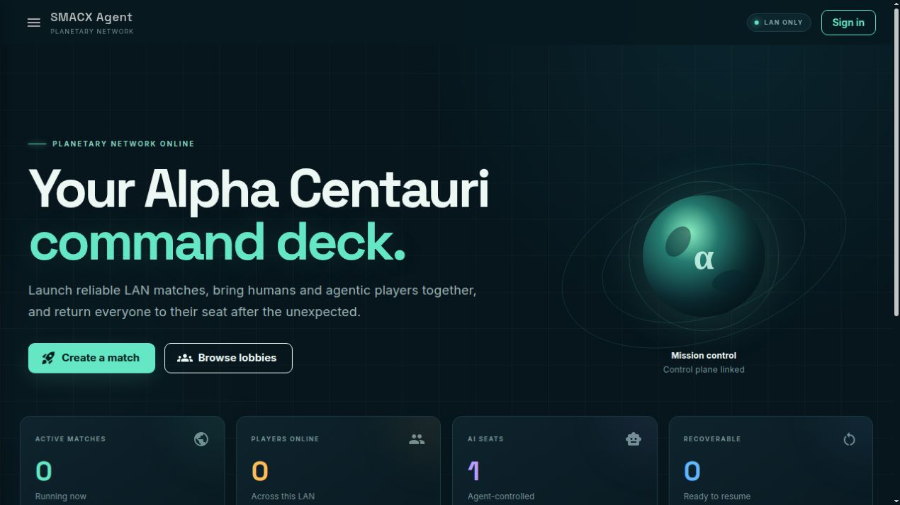
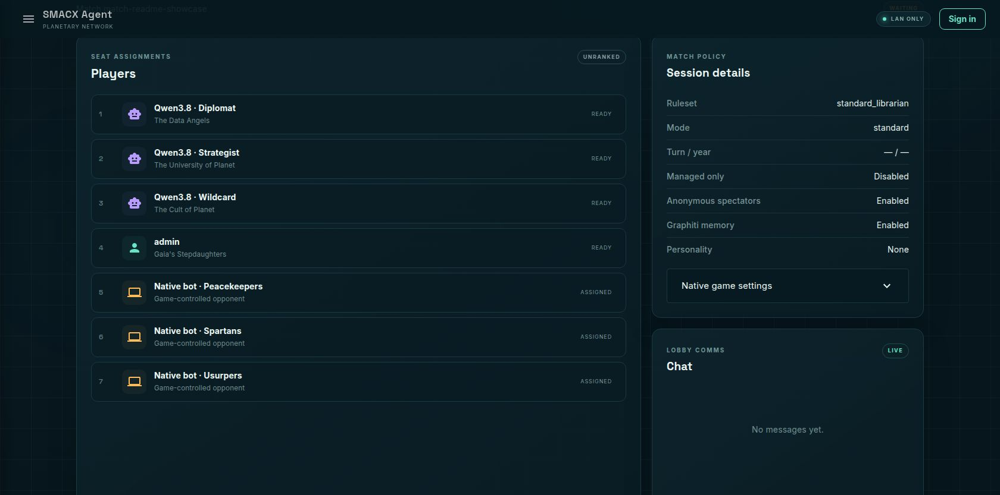
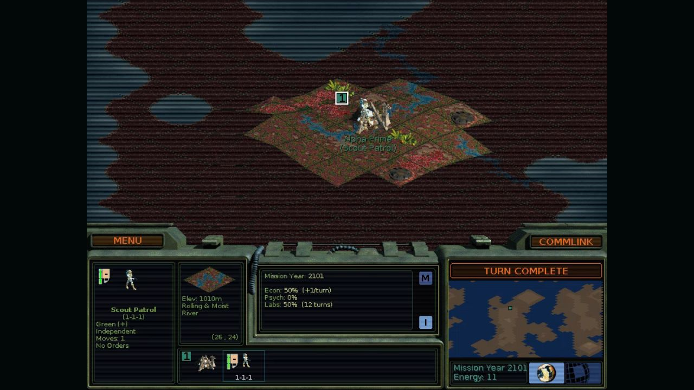
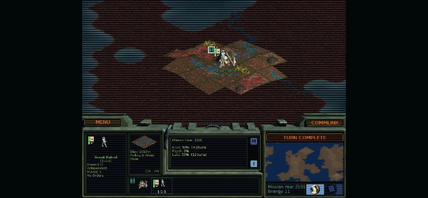

# SMACX Agent

## Play Alien Crossfire like it is 2026

Sid Meier's Alpha Centauri is still brilliant. Getting a 1999 DirectPlay game
to behave like a modern multiplayer game is not.

Windows 11 commonly sends players looking for community compatibility patches.
Linux runs the game remarkably well through Wine and Proton, but multiplayer
still needs legacy DirectX components, a carefully prepared prefix, and enough
ritual that inviting someone for a casual game stops feeling casual. Then a
player disconnects, a long campaign needs to be resumed, or somebody wants to
join from a machine where the game was never configured.

SMACX Agent turns one Linux host and your existing Alien Crossfire installation
into a persistent private game table for your household and invited friends. Open a website, create the lobby you
actually want, and play the real game from a browser—or join with a traditional
native client. Add humans, stock computer factions, autonomous LLM players, or
no AI at all.

This is not a remake. It is the original game, made dramatically easier to
host, watch, resume, explore, and share.

<p align="center">
  
</p>
<p align="center"><sub><strong>The command deck:</strong> one private home for creating, joining, recovering, and watching games.</sub></p>

> Linux-first, effortless on a trusted LAN, and invitation-gated over the Internet. This project
> does not include or distribute Sid Meier's Alpha Centauri, Alien Crossfire,
> or other proprietary game assets. You provide your own installation.

## One host. Any screen. Same Planet.

Create a standard game, an installed scenario, or a deeply customized match
from a friendly web lobby. Pick the world, difficulty, Planet traits, turn
clock, victory conditions, advanced rules, humans, native bots, and optional AI
players without walking through the original setup screens.

<p align="center">
  
</p>
<p align="center"><sub><strong>Build the table you want:</strong> humans, named AI profiles, and the original game's bots can share all seven seats.</sub></p>

When the game starts, every managed human gets the real `terranx.exe` streamed
through the portal with video, audio, mouse, keyboard, shortcuts, text entry,
fullscreen, and reconnect support.

<p align="center">
  
</p>
<p align="center"><sub><strong>This is the real game:</strong> an isolated managed instance of <code>terranx.exe</code>, live in a browser at a mobile-friendly native resolution and ready to reconnect.</sub></p>

- Play at a desktop without installing or patching the game there.
- Open the same private site from a laptop, tablet, phone, Full HD monitor, or
  ultrawide display. Managed native profiles run from 800×600 through
  5120×1440, while instant CSS fitting preserves the game aspect ratio at any
  browser size. Landscape fullscreen is the sweet spot on small screens.
- Use your own native game client when that is what you prefer. The lobby gives
  you the exact host, session, public display name, and faction details.
- Keep one durable public display name and campaign history whether you prefer the
  managed browser path or a traditional native seat.

Your wife does not need to learn Wine prefixes to join from the next room. A
remote friend proves ownership once from a desktop browser, without uploading
game content, and still never needs your carefully tuned Linux setup. After
that, they can open your private site from any of their devices and take their
seat.

<p align="center">
  
</p>
<p align="center"><sub><strong>Planet in your pocket:</strong> the complete 800×600 game, aspect-correct and scroll-free in a phone-sized landscape viewport.</sub></p>

Install the command deck from its own **Install app** page and it becomes a
focused desktop or home-screen app with the same lobbies, play links,
spectating, and reconnect behavior. Chromium gets a real one-click install
prompt when available; Safari, Firefox, and platform-specific fallbacks get
clear local instructions instead of a dead button. The installed experience
remains attached to your private host—gameplay and authentication are never
pretended to be offline.

On the host, loopback works immediately. Phones, tablets, and other LAN
devices can use the ordinary HTTP portal, including browser play and
spectating through an automatic video compatibility path. Browser audio and
PWA installation on another device need the trusted HTTPS origin supplied by
a configured invited-friends hostname (or another trusted local certificate).
Once installed, Planet can sit beside any
other game in a launcher even though the original Windows executable remains
isolated on the Linux host.

The original MENU button also becomes the doorway to managed play. While its
plain root menu is open, a compact human-only control rail appears for
fullscreen, display policy, modern chat, the Datalinks Wiki, votes, and session recovery. It
vanishes before a native submenu or modal can cover it, never appears for an AI
seat, and never turns browser chrome into part of the agent's action surface.

The same locally built Datalinks that teaches an AI the rules is a polished
wiki for everyone at the table. Browse a real hierarchy of core rules,
facilities, Secret Projects, units, social engineering, Planet, factions, and
the complete technology set; follow breadcrumbs and an article outline; or use
hybrid exact-name, BM25, and semantic search. Open it from the command deck or
inside a running game without leaving Planet. The project distributes the
reader and acquisition pipeline—not the acquired game or wiki prose.

## Table talk without a 1999 chat window

The native network still carries the conversation, but humans and agents get a
modern durable view of it. Broadcast to everyone, privately contact a faction
you have actually met, or create a named group whose members must each consent
before it becomes active. Durable history survives reconnects and tells you
which player and faction spoke.

A group message is one logical message even though DirectPlay delivers a
private copy to each member. Humans see one clean conversation; an AI sees one
semantic event, not duplicated evidence that accidentally looks more
important. Private and group bodies are authorization-filtered rather than
broadcast through the lobby's live-update channel.

## A campaign that survives real life

Alpha Centauri games can outlive an evening. SMACX Agent treats the campaign as
the durable thing and the running processes as replaceable.

Checkpoint a game, park every managed player, and shut down the disposable game
workers. Later, recover the verified save, restore the exact factions and
seats, reconnect the browsers, and resume the same campaign. Each checkpoint
binds the native save to the AI's Hermes conversation, journal head, modern-chat
groups, and derived Graphiti generation. Recovery restores that whole boundary,
so the AI cannot remember plans or actions that the restored world never kept.

The Control Center stays running between games and host restarts. It keeps your
accounts, lobby history, active and parked matches, player associations, saves,
chat, AI profiles, and analytics in one place. Run separate matches for friends
or experiments without repeatedly rebuilding or taking the platform down.

Staging behaves like a modern room rather than a dead reservation list. The
creator begins in a playable seat, can step out to observe, and gets a visible
30-second reconnect window if their last lobby tab disappears. Multiple tabs
are understood, abandoned seats reopen automatically, and invited or
traditional native-client seats remain deliberately reserved.

Its Campaign Library stays useful as that collection grows: search and filter
active, resumable, and completed games, park an AI simulation for later, or end
it permanently while retaining the political history, outcomes, telemetry,
and model configuration that made the campaign unique.

It does this without cloning a complete Windows desktop for every parked seat.
One installation-local prepared game and Proton layer is shared by concurrent
players; active seats keep isolated copy-on-write state, parked saves are
zstd-compressed under an administrator-controlled retention policy, and a
completed campaign keeps one final verified checkpoint beside its history and
analytics.

This is recovery, not a turn-rewind feature. Only the latest verified recovery
generation is retained: a replacement Hermes snapshot is published before its
obsolete predecessor is collected, and Graphiti rebuilds the restored timeline
before its superseded graph namespace is deleted.

If a browser refreshes, reconnect it. A second tab opens safely as a viewer;
it must explicitly take control, and doing so immediately revokes the old
tab's input stream. Browser back/close receives a leave warning, while the
managed **Exit game view** action leaves the faction reserved. If somebody
reaches the original game's Quit confirmation anyway, the human-only semantic
bridge cancels it and points them back to the managed exit path. If a managed
worker dies, the supervisor reconciles it.

If every managed browser player leaves an unfinished game, a visible ten-minute
grace period begins. Reconnecting cancels it. Otherwise the platform waits for
a verified safe checkpoint and parks the campaign instead of leaving forgotten
Windows processes burning forever in the corner. AI-only simulations keep
running; direct/native seats are never guessed from browser presence.

Lobby setup is equally deliberate: create the world and rules first, then
assemble all seven seats in one staging room. Take or leave a faction, reserve
friends, add or remove AI and stock opponents, and choose every faction before
anything launches. Regular members can keep up to five waiting rooms;
administrators are unlimited for simulations. A waiting room remains live while
at least one signed-in human has its staging page open; after the final viewer
leaves, a visible 30-minute expiration begins.

Disruptive changes are treated like table decisions, not surprise process
kills. Native resolution changes, temporary computer control for an absent
player, seat reclaim, host transfer, parking, and ending a match use persisted
votes among the other connected humans. A passed vote authorizes the request;
it still cannot bypass the game's stable-checkpoint gate. While the game is
unsafe to save, everyone keeps playing. Only after three synchronized native
samples and a verified save does the platform park, reconfigure, recover, and
put the same factions back in their seats.

## Humans-only is a first-class game

You do not need a model endpoint, an API key, Hermes, Graphiti, or any interest
in artificial intelligence to use SMACX Agent.

As a modern human game host it already gives you:

- one responsive lobby directory for standard, custom, and scenario games;
- lightweight private-host accounts with durable, case-insensitive public display names;
- browser play that removes per-player game installation and compatibility
  setup;
- installable desktop/mobile command deck with a guided cross-browser PWA
  flow;
- an organized, responsive Datalinks Wiki with safe Markdown rendering,
  hybrid search, and an in-game reader;
- adaptive native resolution from phone-friendly 800×600 to 5K ultrawide,
  adaptive H.264 bitrate, instant per-device fitting, and fullscreen;
- ordinary native-client joining for players who want it;
- durable global, private, and consent-based group chat with player/faction
  attribution;
- reconnectable seats, safe player-approved temporary bot delegation,
  verified saves, parking, and automatic recovery;
- concurrent lobbies and campaigns;
- non-playing administrator observation; and
- optional authenticated, read-only spectating for a lobby, with campaign
  participants permanently excluded from enemy views.

An AI-only tournament is possible. So is a completely ordinary game with your
family. So is watching friends finish a match from your phone without taking a
seat.

## Then add players that have something to say

Connect any OpenAI-compatible model endpoint and turn a discovered model into a
named player profile. The platform starts and supervises the agent
for its assigned seat; there is no separate host Hermes dashboard to install or
babysit.

Every AI seat can choose its own faction and personality. Standard preserves
the faction's canonical worldview; Friendly, Aggressive, and Extreme explore
recognizable variations; Random locks one variant for that match; and None
leaves temperament entirely to the model. The built-in library contains 56
authored personalities across all fourteen original and Alien Crossfire
factions.

The model profile stays backstage. At the table the AI appears as the faction
leader it actually plays—Lady Deirdre Skye, Chairman Sheng-ji Yang, Datajack
Sinder Roze, Conqueror Marr, and the rest—in the lobby, native game, chat,
history, and spectator tooling. Factions are selected through the native game
semantically, duplicate assignments are prevented, and the final running
faction is verified before the personality-bearing agent is allowed to start.

These players do not aim a vision model at screenshots and hope it clicks the
right pixel. A native bridge inside the real game gives each model structured
observations and guarded semantic actions. The model can inspect its legitimate
world, manage bases and units, research, terraform, trade, negotiate, use
public or private chat, participate in the Planetary Council, pursue enabled
victories, and continue across an extremely long campaign.

That perception is strategic, not a firehose of tiles. Each player gets a
continuously maintained fair-play world model with fronts, regions, routes,
reachability, logistics, threats, rendezvous windows, bases, forces, and global
systems. A quiet Huge map stays compact; active wars and contested regions gain
detail automatically. The model can deliberately zoom into what matters while
its current focus, meaningful changes, critical chat, plans, commitments, and
uncertainty remain in view. The result is an AI that can reason about a peninsula
defense or a two-front reserve problem—not merely click whatever unit is awake.

Fog of war remains fog. The AI receives its own faction's perspective, not
omniscient save data. It cannot escape into mouse automation when confused.
Every consequential action is checked against current native state, and a
missing capability becomes an explicit development report rather than a secret
clicking fallback.

Before playing, an agent must read and acknowledge the actual match briefing:
its faction, scenario, timer, victory conditions, custom rules, and other
relevant settings. That compact configuration remains valid through ordinary
turns and same-settings recovery; only an actual rule, scenario, seat, policy,
or game-artifact change relocks play. On first run, a private SemanticKnowledge mechanics
encyclopedia builds from the operator's installation and explicit public
sources, with fixed Wayback fallbacks. Weighted hybrid BM25 and semantic retrieval gives the
agent focused rules evidence without feeding it walkthroughs, cheese
strategies, or hidden match information—and acquired prose never enters the
repository or a distributed image.

## Diplomacy with a memory longer than one prompt

The fun is not merely whether a model can move a rover. It is whether the
player across the table remembers why it no longer trusts you.

Each AI seat has durable, match-scoped memory for facts, beliefs,
relationships, commitments, goals, summaries, and chat history. An agent can
separate what it observed from what you claimed, remember an unpaid favor,
track a border agreement, question an ally's suspicious explanation, forgive a
betrayal—or decide not to.

Those memories are isolated by match, player, perspective, native session, and
timeline.
One faction cannot inherit another faction's secrets, and a new campaign does
not begin with grudges from the last one.

For installations that want to push further, optional Graphiti and FalkorDB add a
temporal knowledge graph over that political history. Routine unit motion is
not dumped into it: curated diplomacy, chat, commitments, beliefs, incidents,
and important history are projected asynchronously, then recalled only within
the exact match/player perspective. SemanticKnowledge and Graphiti share one
configurable embedding runtime instead of loading duplicate models. A
hash-linked campaign journal remains authoritative and can rebuild both its
working search index and Graphiti, so the graph is an enhancement rather than a
new point of failure. Meaningful boundaries are committed to a private local
Git history, making a campaign inspectable without recording raw model
scratchpads or game assets. A content-free embedding observatory separates encyclopedia builds
and searches from Graphiti projection and recall, measures latency and effective
throughput, and runs a semantic quality canary without retaining prose, prompts,
vectors, credentials, chat, or model reasoning.

## Watch the game—or the experiment

Every managed seat renders independently. A non-playing administrator can switch
between players and watch a human or AI screen without disturbing it. A lobby can
also opt into authenticated spectating, while AI-only simulations are always
observable by signed-in nonparticipants. Read-only access is enforced at the
stream transport rather than by a decorative disabled button. Anyone assigned a player
faction in that campaign—including an administrator—can never use the spectator
deck to inspect another perspective.

The same Control Center makes SMACX Agent useful as an AI game laboratory.
Create durable named model identities, vary reasoning, official or custom
sampling, output limits, and context,
run unattended matches, and compare:

- match outcomes and victory types;
- turn duration and errors;
- provider calls;
- input, output, cache, and reasoning tokens; and
- results by durable AI profile.

Use the built-in reports, CSV export, or the constrained read-only SQL lab.
Watch the screen when a model surprises you, inspect its scoped game records,
and turn a capability gap into a reproducible engineering task. Unsupported
native states stop the affected AI before it can loop, alert the lobby and
browser player, preserve the game for diagnosis, and produce a one-click,
redacted ZIP ready to attach to a GitHub issue. The paused state remains
visible after the report is dismissed; once an update is installed, the owner
can rebuild that seat on the current runtime and retry from its verified
checkpoint without silently discarding the campaign.

This makes it possible to ask more interesting questions than “did the bot
win?” Did extra reasoning matter? Did the model negotiate? Did it remember the
deal? Was it strong, merely expensive, or—most importantly—fun to play with?

## What the Control Center owns for you

| Experience | What you get |
| --- | --- |
| **Create** | Typed standard/custom/scenario setup, durable waiting lobbies, seven-seat composition, human/AI/native-bot mixing |
| **Play** | Installable command deck; real game streaming with audio/input/fullscreen; true 800×600-to-5120×1440 profiles; adaptive bitrate; one-controller tab safety; instant fit, reconnect, or native-client joining |
| **Host** | Isolated game workers, prepared Proton environments, DirectPlay setup, exact player identity, concurrent matches |
| **Watch** | Non-player admin seat switching, always-observable AI-only simulations, opt-in authenticated spectating for human games, permanent participant exclusion, worker-enforced read-only streams |
| **Continue** | Connected-player votes, stable-boundary checkpoints, safe temporary bot delegation/reclaim, crash reconciliation, faction restoration |
| **Remember** | Chat history and scoped AI facts, beliefs, relationships, promises, goals, and summaries |
| **Experiment** | Stable named model profiles with editable templates, advanced provider parameters, honest acceptance checks, telemetry, outcomes, analytics, CSV, and constrained SQL reports |

## Bring your copy and open the table

The managed host currently targets Linux with Docker Engine and Compose. You
also need:

- an existing Alien Crossfire directory containing `terranx.exe`; and
- Docker Engine with Compose v2.

Follow [Getting started: localhost and LAN](docs/lan-installation.md) for the
complete first-run flow—from Docker and locating `terranx.exe` through the
administrator account and first lobby.

The worker image fetches checksum-pinned, open-source GE-Proton and the
archived original Microsoft DirectX redistributable during its reproducible
build. They are sealed into the container image; Steam, Wine, Proton, prefixes,
and DirectPlay never need to be configured through the website or installed
for each player.

Start the persistent platform:

```bash
SMACX_GAME_SOURCE="/absolute/path/to/Sid Meier's Alpha Centauri" \
  ./scripts/control-center-up.sh
```

Read the one-time administrator token:

```bash
docker compose exec -T control-center dotnet Smacx.Portal.dll bootstrap-token
```

Open <http://127.0.0.1:8080>, finish the one-time administrator setup, and
create a lobby. The same address is published on the host's private interfaces,
so another household device opens `http://HOST-LAN-IP:8080`. The configured game
source is validated automatically at startup and the portal shows the complete
managed stack as one readiness check.

Browser players need only that private URL. Native players use their own game
installation and may still need the community compatibility work appropriate
to their operating system. AI seats are optional; add a model provider only if
you want them.

For invited Internet play, keep this same installation and add a hostname to
the included Caddy edge. Remote account creation requires a single-use,
24-hour invitation; remote sign-in requires HTTPS and a one-time local browser
check of the player's own installation. No game file is uploaded. See
[Internet hosting for friends](docs/internet-hosting.md). The service is a
private game table, not public matchmaking.

Use [Network access and play modes](docs/network-access.md) for one precise
comparison of localhost, trusted-LAN browsers, invited Internet browsers,
physical-LAN native clients, and private Tailscale native clients. Friends who
only need to play can follow the short [Joining a SMACX Agent
server](docs/joining-a-server.md) guide.

For complete prerequisites, runtime registration, networking, accounts,
providers, lobbies, streams, saves, and recovery, use the
[operator guide](docs/control-center.md).

## Respectful usage analytics

SMACX Agent uses cookie-free Plausible Analytics to give the maintainer one
quiet but meaningful signal: whether people are using the project. This is
especially valuable for niche open-source software whose real community may
not show up through stars or discussions. Self-hosted portal pages send limited,
aggregate page-view, download, and outbound-link activity to the maintainer's
Plausible endpoint; game data, chat, credentials, saves, AI conversations, and
installation fingerprints are not sent. See the complete [privacy
notice](docs/privacy.md).

## Go deeper

The front page tells the product story. Operator and developer documentation
goes deeper where needed. The [documentation index](docs/README.md) routes
hosts, invited players, operators, AI configurators, and contributors separately:

- [Operator guide](docs/control-center.md)
- [Getting started: localhost and LAN](docs/lan-installation.md)
- [Network access and play modes](docs/network-access.md)
- [Internet hosting for invited friends](docs/internet-hosting.md)
- [Joining a SMACX Agent server](docs/joining-a-server.md)
- [Managed play, display, chat, voting, and recovery](docs/managed-play.md)
- [Installable app and trusted HTTPS](docs/installable-app.md)
- [Architecture and trust boundaries](docs/architecture.md)
- [Agent loop and fair-play contract](docs/agent-loop.md)
- [MCP tool reference](docs/tools.md)
- [Mechanics encyclopedia and copyright boundary](docs/reference-knowledge.md)
- [Optional Graphiti temporal memory](docs/graphiti.md)
- [Contributor testing](docs/testing.md)
- [Privacy and aggregate usage analytics](docs/privacy.md)
- [Troubleshooting](docs/troubleshooting.md)

## License

SMACX Agent is licensed under Apache License 2.0. Thinker-derived code retains
its MIT notice; see [NOTICE.md](NOTICE.md).

This project is not endorsed by or affiliated with EA or its licensors.
