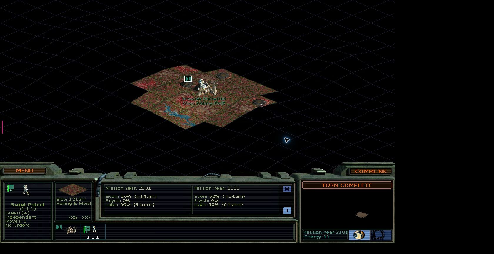

# SMACX Agent

## Play Alien Crossfire like it is 2026

Sid Meier's Alpha Centauri is still brilliant. Getting a 1999 DirectPlay game
to behave like a modern multiplayer game is not.

Windows 11 commonly sends players looking for community compatibility patches.
Linux runs the game remarkably well through Wine and Proton, but multiplayer
still needs legacy DirectX components, a carefully prepared prefix, and enough
ritual that inviting someone for a casual game stops feeling casual. Then a
player disconnects, a long campaign needs to be resumed, or somebody wants to
join from a machine where the game was never configured.

SMACX Agent turns one Linux host and your existing Alien Crossfire installation
into a persistent private-LAN game table. Open a website, create the lobby you
actually want, and play the real game from a browser—or join with a traditional
native client. Add humans, stock computer factions, autonomous LLM players, or
no AI at all.

This is not a remake. It is the original game, made dramatically easier to
host, watch, resume, explore, and share.

<p align="center">
  
</p>
<p align="center"><sub><strong>The command deck:</strong> one private-LAN home for creating, joining, recovering, and watching games.</sub></p>

> Linux-first and built for localhost or a trusted private LAN. This project
> does not include or distribute Sid Meier's Alpha Centauri, Alien Crossfire,
> or other proprietary game assets. You provide your own installation.

## One host. Any screen. Same Planet.

Create a standard game, an installed scenario, or a deeply customized match
from a friendly web lobby. Pick the world, difficulty, Planet traits, turn
clock, victory conditions, advanced rules, humans, native bots, and optional AI
players without walking through the original setup screens.

<p align="center">
  
</p>
<p align="center"><sub><strong>Build the table you want:</strong> humans, named AI profiles, and the original game's bots can share all seven seats.</sub></p>

When the game starts, every managed human gets the real `terranx.exe` streamed
through the portal with video, audio, mouse, keyboard, shortcuts, text entry,
fullscreen, and reconnect support.

<p align="center">
  
</p>
<p align="center"><sub><strong>This is the real game:</strong> an isolated managed instance of <code>terranx.exe</code>, live in a browser and ready to reconnect.</sub></p>

- Play at a desktop without installing or patching the game there.
- Open the same private site from a laptop, tablet, or phone. The fixed game
  desktop scales to the browser while preserving its aspect ratio; landscape
  fullscreen is the sweet spot on small screens.
- Use your own native game client when that is what you prefer. The lobby gives
  you the exact host, session, handle, and faction details.
- Keep one durable player handle and campaign history whether you prefer the
  managed browser path or a traditional native seat.

Your wife does not need to learn Wine prefixes to join from the next room. Your
friend does not need your carefully tuned Linux setup. They open the LAN site,
claim their handle, and take their seat.

## A campaign that survives real life

Alpha Centauri games can outlive an evening. SMACX Agent treats the campaign as
the durable thing and the running processes as replaceable.

Checkpoint a game, park every managed player, and shut down the disposable game
workers. Later, recover the verified save, restore the exact factions and
seats, reconnect the browsers, and resume the same campaign. AI conversations
and political memory return with it.

The Control Center stays running between games and host restarts. It keeps your
accounts, lobby history, active and parked matches, player associations, saves,
chat, AI profiles, and analytics in one place. Run separate matches for friends
or experiments without repeatedly rebuilding or taking the platform down.

If a browser refreshes, reconnect it. If a managed worker dies, the supervisor
reconciles it.
If everyone leaves an unfinished managed game, park it safely instead of
leaving a forgotten Windows process burning forever in the corner.

## Humans-only is a first-class game

You do not need a model endpoint, an API key, Hermes, Graphiti, or any interest
in artificial intelligence to use SMACX Agent.

As a modern human game host it already gives you:

- one responsive lobby directory for standard, custom, and scenario games;
- lightweight private-LAN accounts with durable, case-insensitive game handles;
- browser play that removes per-player game installation and compatibility
  setup;
- ordinary native-client joining for players who want it;
- public and private chat with player and faction attribution;
- reconnectable seats, verified saves, parking, and recovery;
- concurrent lobbies and campaigns;
- administrator cross-seat viewing; and
- optional anonymous, read-only spectating for a lobby.

An AI-only tournament is possible. So is a completely ordinary game with your
family. So is watching friends finish a match from your phone without taking a
seat.

## Then add players that have something to say

Connect any OpenAI-compatible model endpoint and turn a discovered model into a
named, versioned player profile. The platform starts and supervises the agent
for its assigned seat; there is no separate host Hermes dashboard to install or
babysit.

These players do not aim a vision model at screenshots and hope it clicks the
right pixel. A native bridge inside the real game gives each model structured
observations and guarded semantic actions. The model can inspect its legitimate
world, manage bases and units, research, terraform, trade, negotiate, use
public or private chat, participate in the Planetary Council, pursue enabled
victories, and continue across an extremely long campaign.

Fog of war remains fog. The AI receives its own faction's perspective, not
omniscient save data. It cannot escape into mouse automation when confused.
Every consequential action is checked against current native state, and a
missing capability becomes an explicit development report rather than a secret
clicking fallback.

Before playing, an agent must read and acknowledge the actual match briefing:
its faction, scenario, timer, victory conditions, custom rules, and other
relevant settings. A local Alien Crossfire mechanics encyclopedia gives it the
rules and exact installed-game data it needs without feeding it walkthroughs,
cheese strategies, or hidden match information.

## Diplomacy with a memory longer than one prompt

The fun is not merely whether a model can move a rover. It is whether the
player across the table remembers why it no longer trusts you.

Each AI seat has durable, match-scoped memory for facts, beliefs,
relationships, commitments, goals, summaries, and chat history. An agent can
separate what it observed from what you claimed, remember an unpaid favor,
track a border agreement, question an ally's suspicious explanation, forgive a
betrayal—or decide not to.

Those memories are isolated by match, player, perspective, and native session.
One faction cannot inherit another faction's secrets, and a new campaign does
not begin with grudges from the last one.

For installations that want to push further, optional Graphiti and Neo4j add a
temporal knowledge graph over that political history. SQLite remains the
authoritative memory, so the game keeps working when the experimental graph or
embedding service is unavailable. Graphiti is an enhancement, not a new point
of failure.

## Watch the game—or the experiment

Every managed seat renders independently. An administrator can switch between
players and watch a human or AI screen without disturbing it. A lobby can also
opt into anonymous LAN spectating, with read-only enforcement at the stream
transport rather than a decorative disabled button.

The same Control Center makes SMACX Agent useful as an AI game laboratory.
Keep multiple named versions of a model profile, vary reasoning or context,
run unattended matches, and compare:

- match outcomes and victory types;
- turn duration and errors;
- provider calls;
- input, output, cache, and reasoning tokens; and
- results by durable model/profile version.

Use the built-in reports, CSV export, or the constrained read-only SQL lab.
Watch the screen when a model surprises you, inspect its scoped game records,
and turn a capability gap into a reproducible engineering task.

This makes it possible to ask more interesting questions than “did the bot
win?” Did extra reasoning matter? Did the model negotiate? Did it remember the
deal? Was it strong, merely expensive, or—most importantly—fun to play with?

## What the Control Center owns for you

| Experience | What you get |
| --- | --- |
| **Create** | Typed standard/custom/scenario setup, durable waiting lobbies, seven-seat composition, human/AI/native-bot mixing |
| **Play** | Real game streaming with audio and input, browser reconnect, mobile/tablet scaling, or native-client joining |
| **Host** | Isolated game workers, prepared Proton environments, DirectPlay setup, exact player identity, concurrent matches |
| **Watch** | Admin seat switching, AI observation, opt-in anonymous spectator deck, worker-enforced read-only streams |
| **Continue** | Verified checkpoints, safe parking, crash reconciliation, faction restoration, campaign recovery |
| **Remember** | Chat history and scoped AI facts, beliefs, relationships, promises, goals, and summaries |
| **Experiment** | Versioned model profiles, telemetry, outcomes, analytics, CSV, and constrained SQL reports |

## Bring your copy and open the table

The managed host currently targets Linux with Docker Engine and Compose. You
also need:

- an existing Alien Crossfire directory containing `terranx.exe`;
- a Proton distribution directory; and
- the February 2010 DirectX redistributable used to prepare native DirectPlay.

Start the persistent platform:

```bash
SMACX_DIRECTX_REDIST=/absolute/path/to/directx_feb2010_redist.exe \
  ./scripts/control-center-up.sh
```

Read the one-time administrator token:

```bash
docker compose exec -T control-center dotnet Smacx.Portal.dll bootstrap-token
```

Open <http://127.0.0.1:8080>, finish the one-time administrator setup, register
the game and Proton locations, and create a lobby. Publish the portal to a
trusted household LAN when other devices should join:

```bash
SMACX_PORTAL_PUBLISH=0.0.0.0:8080 \
SMACX_DIRECTX_REDIST=/absolute/path/to/directx_feb2010_redist.exe \
  ./scripts/control-center-up.sh
```

Browser players need only that private URL. Native players use their own game
installation and may still need the community compatibility work appropriate
to their operating system. AI seats are optional; add a model provider only if
you want them.

The portal is designed for localhost and trusted private LANs, not public
Internet hosting or matchmaking. Do not port-forward it as a public service.

For complete prerequisites, runtime registration, networking, accounts,
providers, lobbies, streams, saves, and recovery, use the
[operator guide](docs/control-center.md).

## Go deeper

The front page tells the product story. Detailed claims and engineering
evidence live where they can stay precise:

- [Project status and validation](docs/project-status.md)
- [Operator guide](docs/control-center.md)
- [Architecture and trust boundaries](docs/architecture.md)
- [Semantic gameplay coverage](docs/coverage.md)
- [Agent loop and fair-play contract](docs/agent-loop.md)
- [MCP tool reference](docs/tools.md)
- [Mechanics encyclopedia and copyright boundary](docs/reference-knowledge.md)
- [Optional Graphiti temporal memory](docs/graphiti.md)
- [Testing and reproducible evidence](docs/testing.md)
- [Troubleshooting](docs/troubleshooting.md)

## License

SMACX Agent is licensed under Apache License 2.0. Thinker-derived code retains
its MIT notice; see [NOTICE.md](NOTICE.md).
